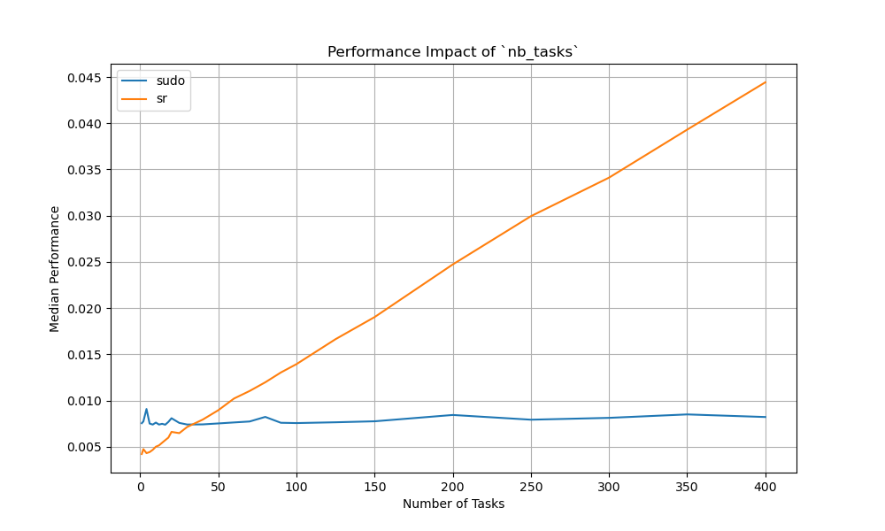
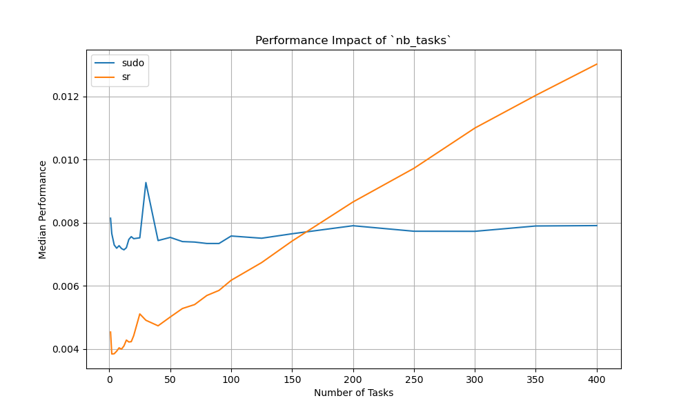

# RootAsRole performance test

This repository contains a performance test for the RootAsRole project compared to sudo.

> [!WARNING]
> This project reinstall the `sudo` package and the `sudoers` file. It is recommended to run it in a virtual machine or a container.

## Prerequisites

- Python 3.8 or later
- Ansible

## Installation

```bash
ansible-playbook install.yml
```

## Usage

### Run the test

You need to edit the `confgen/.cargo/config.toml` file to set JSON as the output format.
There is already two config files in the `confgen` directory, one for JSON and one for CBOR.

```bash
hyperfine -N --warmup 100 -m 1000 -L nb_tasks 1,2,4,6,8,10,12,14,16,18,20,25,30,40,50,60,70,80,90,100,125,150,200,250,300,350,400 -L nb_users 1 -L nb_roles 1 -L nb_commands 1 --setup 'bin/confgen etc/sudoers etc/rootasrole.json {nb_roles} {nb_users} {nb_tasks} {nb_commands} 1000' --export-json perf_opt_new_sudo.json "bin/sudo /usr/bin/true" "bin/sr /usr/bin/true" --show-output
```

### Generate graphs
You can use the `perf_opt_new_sudo.json` file to generate graphs with the `plot.py` script.

```bash
python3 plot.py perf_opt_new_sudo.json perf_roles.png perf_tasks.png perf_both.png
```

### Current results

The current results are tested on a virtual machine with 4 cores and 8 GB of RAM on a x360 EliteBook 1040 G9.

The graphs below illustrate the performance impact of adding new tasks to the RootAsRole policy for the sr command compared to sudo. The first graph presents the evaluation using a JSON-formatted policy, while the second graph displays the same test with CBOR binary format. The key difference between these formats is a 65% performance improvement with CBOR. Additionally, the slope of the performance curve improves: with CBOR, the sr and sudo lines match beyond 150 tasks, whereas with JSON, they align at fewer than 50. This improvement stems from CBOR’s reduced serialization overhead, resulting in fewer read operations per task.

Our findings indicate that, for a low number of tasks, RootAsRole outperforms sudo, achieving up to 50% better performance (with sudo compiled without LDAP network features). However, as the number of tasks increases, RootAsRole’s overhead grows more rapidly than sudo’s, revealing a scalability overhead that requires further optimization.

**Several technical improvements in Rust’s implementation can largely reduce this overhead:** 

1. Avoiding unnecessary memory allocations for a more efficient execution model (e.g, switching from Referenced Counter pointers to raw pointers, that are allocated for each task). 
2. Optimizing the file parsing structure e.g, completely avoid Vector role allocation but keeping only the better task match during deserialisation process, which could hugely reduce the slope.
3. Many structures lacks of optimization such as the OptStack structure for evaluating the execution environment, which represent around 16% of the slope according to the firefox profiler tool, many structure serialisation data optimisations that we detected during our tests. 

These inefficient computations increase a lot the slope of the line when scaling up. These still needs to be addressed and are in the optimisation plan.

In conclusion, with these enhancements, we expect RootAsRole’s performance curve to closely match sudo’s. However, sudo has fewer security features, so at higher task volumes, it will inevitably perform better. To improve scalability, storing RootAsRole policies in a more efficient structure (rather than a file) is a necessary step. Additionally, for usability, the performance cost of the CBOR version remains reasonable, at 13ms for 400 tasks. For larger deployments, we plan to implement a database-based approach to support distributed policy management. Of course, this is in the scope of RootAsRole project, but not on the current article idea.


