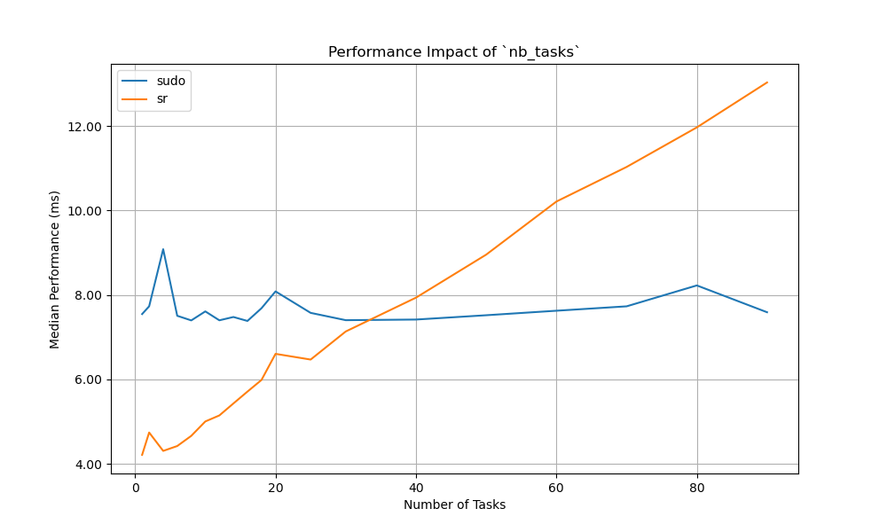
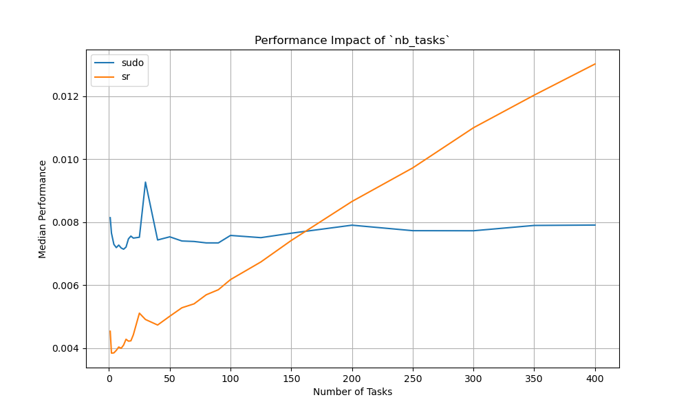
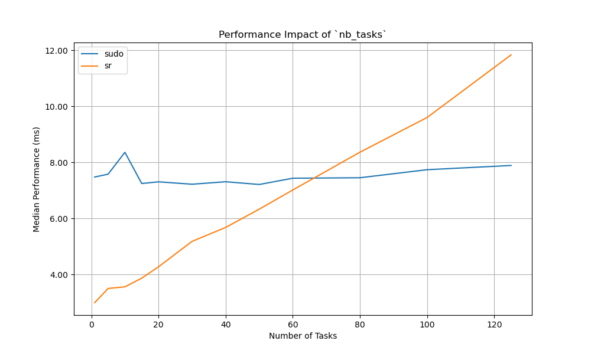
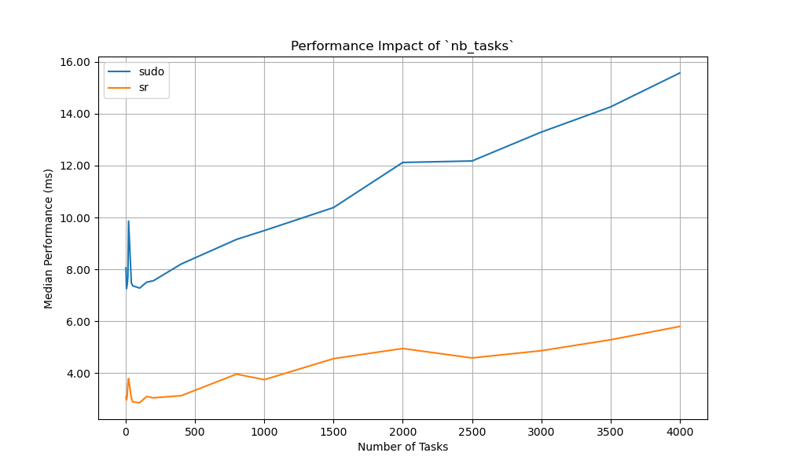

# RootAsRole performance test

This repository contains a performance test for the RootAsRole project compared to sudo.

> [!WARNING]
> This project reinstall the `sudo` package and the `sudoers` file. It is recommended to run it in a virtual machine or a container.

## Prerequisites

- Python 3.8 or later
- Ansible

## Installation

```bash
ansible-playbook install.yml
```

## Usage

### Run the test

You need to edit the `confgen/.cargo/config.toml` file to set JSON as the output format.
There is already two config files in the `confgen` directory, one for JSON and one for CBOR.

```bash
hyperfine -N --warmup 100 -m 1000 -L nb_tasks 1,2,4,6,8,10,12,14,16,18,20,25,30,40,50,60,70,80,90,100,125,150,200,250,300,350,400 -L nb_users 1 -L nb_roles 1 -L nb_commands 1 --setup 'bin/confgen etc/sudoers etc/rootasrole.json {nb_roles} {nb_users} {nb_tasks} {nb_commands} 1000' --export-json perf_opt_new_sudo.json "bin/sudo /usr/bin/true" "bin/sr /usr/bin/true" --show-output
```

### Generate graphs
You can use the `perf_opt_new_sudo.json` file to generate graphs with the `plot.py` script.

```bash
python3 plot.py perf_opt_new_sudo.json perf_roles.png perf_tasks.png perf_both.png
```

### Results

The current results are tested on a virtual machine with 4 cores and 8 GB of RAM on a x360 EliteBook 1040 G9.


#### Before optimization

The performance of RootAsRole is significantly slower than sudo, especially when the number of tasks increases, and the overhead of using JSON for serialization and deserialization is a major factor.

#### After optimization

These optimizations resulted in a 34% raw performance improvement for one task (from 4.9ms to 3.2ms) and enhanced scalability by reducing the slope by 97.15%. Compared to sudo, our program has 66.1% better scalability slope with the CBOR format, and 66.4% better raw performance. However, JSON file format is still less efficient by 97.09% than sudo. We think that we could gain even more performance by using relational database (e.g., Limbo) as RBAC model is relational, it could greatly increase the final performance. Reproductible results can be found here.

### Conclusion

The optimization of RootAsRole outperforms sudo with a 66% improvement in raw performance and scalability slope with the CBOR file format. While JSON remains less efficient, RootAsRole supports interchangeable file formats, enabling users to balance their preference for JSON with the need for performance through CBOR. Future work could explore relational databases like Limbo to further enhance performance. Also, we could test the performance of the Rust implementation of sudo.





