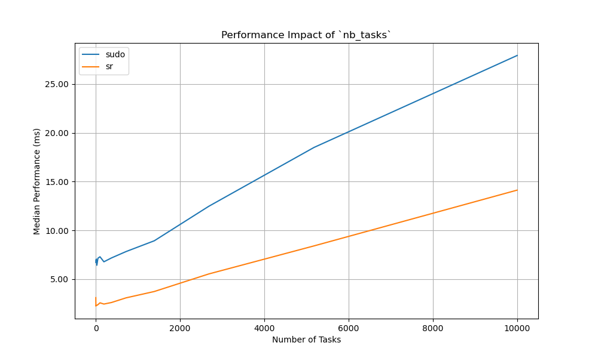

# RootAsRole performance test

This repository contains a performance test for the RootAsRole project compared to sudo.

> [!WARNING]
> This project reinstall the `sudo` package and the `sudoers` file. It is recommended to run it in a virtual machine or a container.

## Prerequisites

- Python 3.8 or later
- Ansible

## Installation

```bash
ansible-playbook install.yml
```

## Usage

### Run the test

You need to edit the `confgen/.cargo/config.toml` file to set JSON as the output format.
There is already two config files in the `confgen` directory, one for JSON and one for CBOR.

```bash
hyperfine -N --warmup 100 -m 100 -L nb_tasks $(python3 log.py 1 10000 15) -L nb_users 1 -L nb_roles 1 -L nb_commands 1 --setup 'bin/confgen etc/sudoers etc/rootasrole.json {nb_roles} {nb_users} {nb_tasks} {nb_commands} 1000' --export-json result_$(date +%y-%m-%d_%H.%M).json "bin/sudo /usr/bin/true" "bin/sr /usr/bin/true" --show-output
```

### Generate graphs
You can use the `perf_opt_new_sudo.json` file to generate graphs with the `plot.py` script.

```bash
python3 plot.py perf_opt_new_sudo.json perf_roles.png perf_tasks.png perf_both.png
```

### Results

The current results are tested on a virtual machine with 4 cores and 8 GB of RAM on a x360 EliteBook 1040 G9.


#### Before optimization

The performance of RootAsRole is significantly slower than sudo, especially when the number of tasks increases, and the overhead of using JSON for serialization and deserialization is a major factor.

#### After optimization

These optimizations resulted in a 34% raw performance improvement for one task (from 4.9ms to 3.2ms) and enhanced scalability by reducing the slope by 97.15%. Compared to sudo, our program has 66.1% better scalability slope with the CBOR format, and 66.4% better raw performance. However, JSON file format is still less efficient by 97.09% than sudo.

However, this optimisation lacks of some features.

#### UPDATED: With every features

Now that the program has all the features and is thread-safe, it performs less well than sudo only when using more than ~7500 tasks (which is already a big policy). It is still possible to re-optimise and perform even better than sudo, even in terms of scalability. With the previous graph, we showed how fast we could be, now it's a long-term optimisation process that has begun. We think that we could gain even more performance by using relational database (e.g., Limbo) as RootAsRole uses a RBAC model and this model is relational, it could greatly increase the final performance.

#### UPDATE #2: Actually, using constants is good...

I found out that my default (fallback) options values were fully dynamically allocated for each task, explaining the big gap in performance during the first update. Now I use constants. and results are better! We have 77% better raw performance and 45% better slope than sudo. It means that we lost 20% of the slope, but seems realistic as we added more features.


